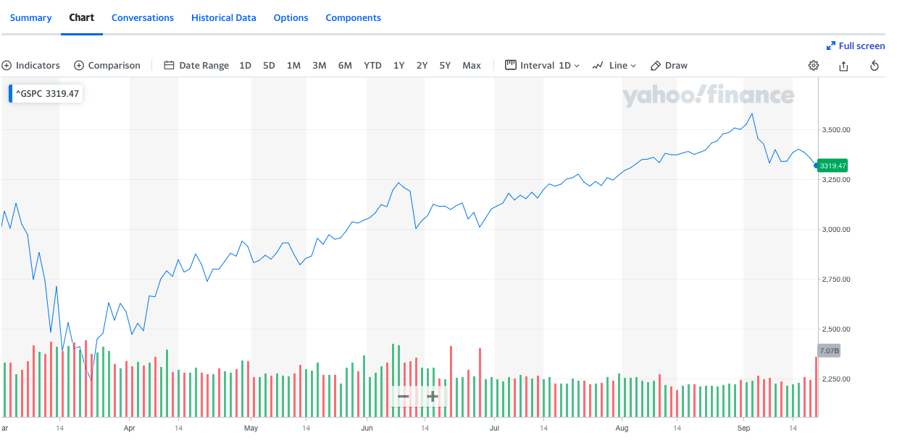
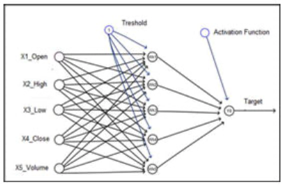
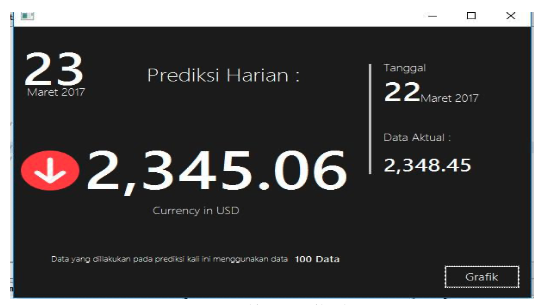
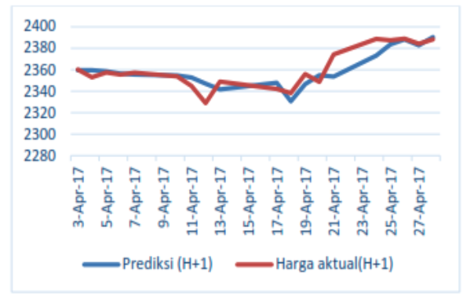
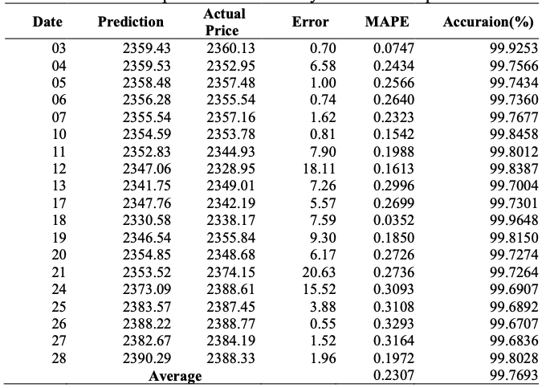

# Predict S&P 500 Stock Closing Price

## Overview
Here is and implementation of the application of the Artificial Neural Network (ANN) is a learning method that can be used for predicion and classification. In this repository, ANN back-propagation is implemented to predict the closing price of the S&P 500 stock exchange using historical data. Historical data consists of five variables, namely open, high, low, close and volume. The historical data are taken from finance.yahoo.com which stores historical data of faily stock proces up to 65 years earlier. You can access into this [URL](https://finance.yahoo.com/quote/%5EGSPC/chart?p=%5EGSPC#eyJpbnRlcnZhbCI6ImRheSIsInBlcmlvZGljaXR5IjoxLCJ0aW1lVW5pdCI6bnVsbCwiY2FuZGxlV2lkdGgiOjgsImZsaXBwZWQiOmZhbHNlLCJ2b2x1bWVVbmRlcmxheSI6dHJ1ZSwiYWRqIjp0cnVlLCJjcm9zc2hhaXIiOnRydWUsImNoYXJ0VHlwZSI6ImxpbmUiLCJleHRlbmRlZCI6ZmFsc2UsIm1hcmtldFNlc3Npb25zIjp7fSwiYWdncmVnYXRpb25UeXBlIjoib2hsYyIsImNoYXJ0U2NhbGUiOiJsaW5lYXIiLCJzdHVkaWVzIjp7IuKAjHZvbCB1bmRy4oCMIjp7InR5cGUiOiJ2b2wgdW5kciIsImlucHV0cyI6eyJpZCI6IuKAjHZvbCB1bmRy4oCMIiwiZGlzcGxheSI6IuKAjHZvbCB1bmRy4oCMIn0sIm91dHB1dHMiOnsiVXAgVm9sdW1lIjoiIzAwYjA2MSIsIkRvd24gVm9sdW1lIjoiI2ZmMzMzYSJ9LCJwYW5lbCI6ImNoYXJ0IiwicGFyYW1ldGVycyI6eyJ3aWR0aEZhY3RvciI6MC40NSwiY2hhcnROYW1lIjoiY2hhcnQifX19LCJwYW5lbHMiOnsiY2hhcnQiOnsicGVyY2VudCI6MSwiZGlzcGxheSI6Il5HU1BDIiwiY2hhcnROYW1lIjoiY2hhcnQiLCJpbmRleCI6MCwieUF4aXMiOnsibmFtZSI6ImNoYXJ0IiwicG9zaXRpb24iOm51bGx9LCJ5YXhpc0xIUyI6W10sInlheGlzUkhTIjpbImNoYXJ0Iiwi4oCMdm9sIHVuZHLigIwiXX19LCJzZXRTcGFuIjp7fSwibGluZVdpZHRoIjoyLCJzdHJpcGVkQmFja2dyb3VuZCI6dHJ1ZSwiZXZlbnRzIjp0cnVlLCJjb2xvciI6IiMwMDgxZjIiLCJzdHJpcGVkQmFja2dyb3VkIjp0cnVlLCJldmVudE1hcCI6eyJjb3Jwb3JhdGUiOnsiZGl2cyI6dHJ1ZSwic3BsaXRzIjp0cnVlfSwic2lnRGV2Ijp7fX0sInN5bWJvbHMiOlt7InN5bWJvbCI6Il5HU1BDIiwic3ltYm9sT2JqZWN0Ijp7InN5bWJvbCI6Il5HU1BDIiwicXVvdGVUeXBlIjoiSU5ERVgiLCJleGNoYW5nZVRpbWVab25lIjoiQW1lcmljYS9OZXdfWW9yayJ9LCJwZXJpb2RpY2l0eSI6MSwiaW50ZXJ2YWwiOiJkYXkiLCJ0aW1lVW5pdCI6bnVsbCwic2V0U3BhbiI6e319XX0-)

## Stack
So basically, this app was build using:

* Java
    
    * Native Java (MVC approach)
    * JavaFX (View/For GUI) so user can access the application

* R Language

    R language is used for:

        * Receive data that has been normalized by JAVA
        * Build Model that want to try
        * Training and Testing using Neural Network library
        * Passing the Prediction to Java GUI
    
## Images
* Architecture Design of ANN on this repository
    

* Sample of Daily Prediction GUI
    

* Graphic of Experiment Result for few days
    

* Table of Experiment Result for few days
    

## Reference
For more information, here is the [journal of this experiment](https://doi.org/10.1088/1742-6596/1175/1/012107).